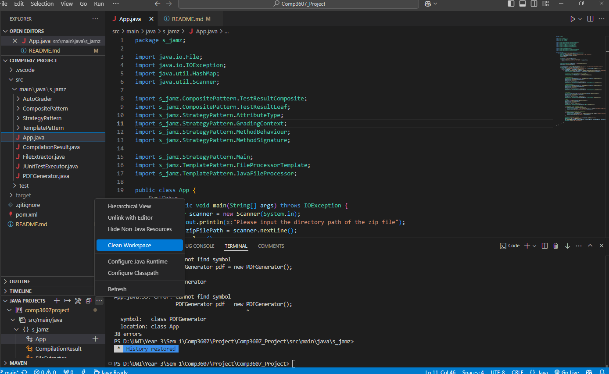
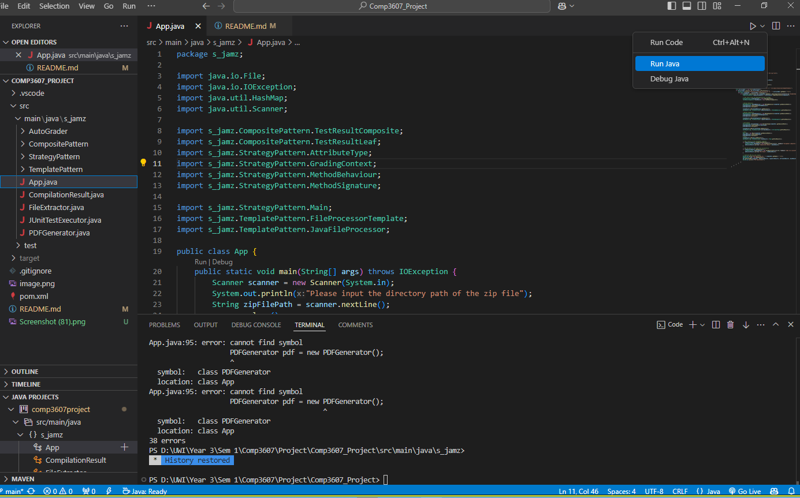

# Comp3607_Project`
Group Contributors

## GROUP 8

Zidane Timothy 
Maia Neptune
Jonathan Swamber
Saeed Khan
April Edwards

**Precursor:**
Please ensure that the .zip files are not folders inside of a zip file 
Format of the zip file to be extracted should be:

StudentSubmissions.zip|
                      |
                      —–FirstName_LastName_ID.zip
                      —–FirstName_LastName1_ID.zip
                      —–FirstName_LastName2_ID.zip
                      —–FirstName_LastName3_ID.zip

**Failure to comply with the indicated format Above or Below may result in skewed results for students**

**Step #1 Clean workspace**

**Step #2 Build All**
.png>)

**Step #3 Run Java**

### Test Data
*Copy the path of the "SuppliedTestSubmissions.zip" file and place into the terminal when requested*